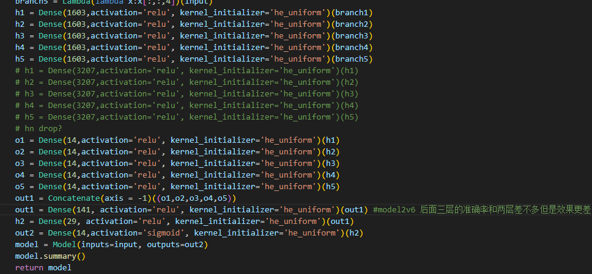
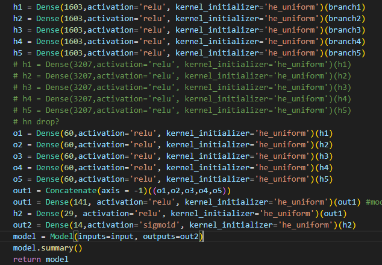
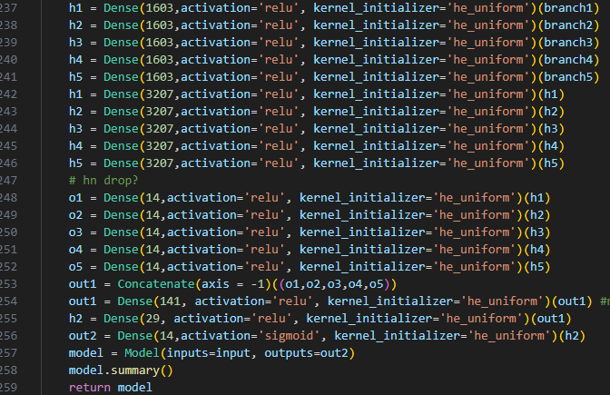
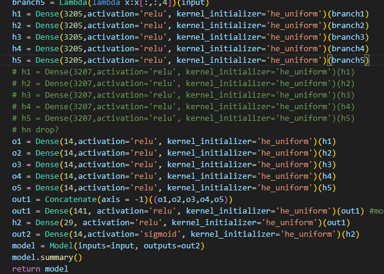
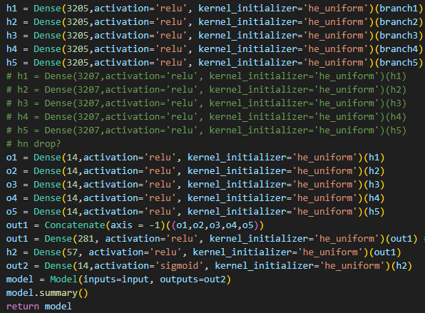
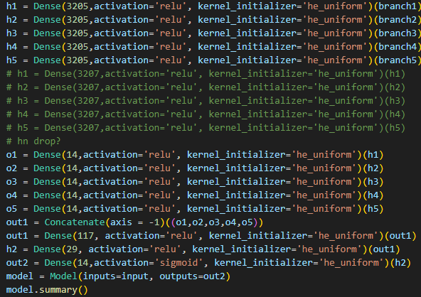
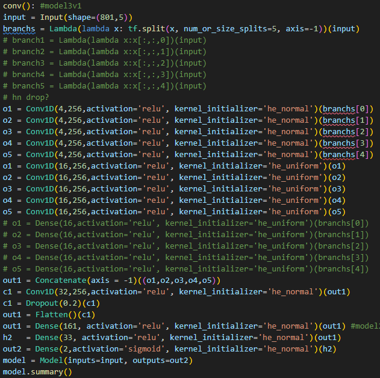
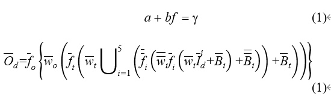

## 网络结构修改

这种结构下，5组只有一组55表现更好些，考虑加多神经元个数？

更改第二层神经元到60之后，效果更差

考虑二层以后都加多，并且学习率可以加大？1000->5000

依然不行，5组中两组训练loss甚至更大

误差与原本相近，loss等有些许降低，效果一般略差

类似

类似

如果想要在调试阶段用这种方式太浪费时间了（1h/轮）
要么重新划分批次？再改进数据集？
要么上平台

切换用卷积层，问题在长时间训练没有收敛，甚至kernel和bias都不变？只有65在第37epoch loss有略微减小，梯度算法问题？问题是这种实质只在一个epoch训练好的网络效果还可以？
## sketch
耦合模理论（Coupling-of-Modes,COM）理论，作为当前设计射频滤波器应用最广泛的理论，其COM参数的准确性对于仿真结果的准确性有着决定性的作用。现在一般通用的提取COM参数的方法如ADS模拟等需要长时间的拟合，在实际面对大量批次的实验数据时成本过高。我们使用机器学习方法搭建了人工神经网络辅助提取COM参数，网络在经过训练后无需经过繁琐反复的优化过程，可直接得到对应的COM参数，也与ADS提取的参数平均只相差……

我们提出的模型使用逆向网络设计，COM理论计算得到的一系列filter metrics objective作为input而COM理论参数作为output。
我们的模型由五层，输入层包括filter admittance, impedance, S11 real and imaginary part, and DSP. 中间层使用全连接，第一、二层使用five branches 分别对 five objectives操作，第三四层将branches 并联起来操作。[1]branch分支ANN
公式？节点选取为2N+1，激活函数等网络细节，节点数量 [2]取点原则（会不会太老了
除开最后的输出层使用sigmoid其他的激活函数使用relu，误差函数使用MSE
权重使用kaiming初始化[3]初始化
训练过程（画图）

输出按批次，第一次得到全部16个值的初始值
真正重要的数据集具体组织：对于想要提取参数的谐振器曲线，我们在一个大范围的参数中随机选取20000组参数组合，对每一组参数用COM理论生成对应的filter metrics objective。由于除声速和反射系数以外的大部分参数对于metrics并不敏感，我们将metrics objective与实测的需拟合曲线做差。将差值作为输入，原本的参数取值作为网络输出。对于objective差值使用Z-score作为归一化手段，参数取值使用maxmin归一化。我们通过逐步精确数据集的方式来弥补网络方面由于缺少GPU/TPU造成的规模受限问题。在预训练之后，全部的参数得到一个粗略初值。根据这些初值确定下一步的参数取值范围，对于不敏感的参数这个范围是50%，对于敏感的参数这个范围是1%。我们根据这更精确的取值范围对于想要提取参数的谐振器曲线同样地使用以上手段生成对应数据集。在得到更准确的参数值之后我们继续精确化数据集参数取值，将范围缩减到20%和0.5%。
在网络训练好之后，由于之前使用差值作为数据集输入，我们使用全0加上一个小量作为网络输入，网络输出对应提取到的参数值，并将参数作为COM参数画出对应metrics图像，从而与原本实测的所需拟合的曲线得到直观对比。
我们针对三种SAW谐振器：提取了其COM参数，其效果如图1-图4

ENG

Our proposed model uses an inverse Artificial Neural Network design, where the inverse lies in the use of a series of filter metrics objective obtained from COM theory calculations as the input and COM theory parameters as the output. As shown in Fig. 1, there are five layers, including the input layer, three hidden layers and the output layer in our customized model. 
The input layer is populated by a vector represented by  I ̅_d=[I ̅_d^1,I ̅_d^2,I ̅_d^3,I ̅_d^4,I ̅_d^5], where I ̅_d^1=[I_1d^1,I_2d^1,I_3d^1,⋯,I_pd^1 ]∈R^p  , is the admittance under the operating frequency band;  I ̅_d^2=[I_1d^2,I_2d^2,I_3d^2,⋯,I_pd^2 ]∈R^p   is the impedance; I ̅_d^3=[I_1d^3,I_2d^3,I_3d^3,⋯,I_pd^3 ]∈R^p   is the S-parameter’s real part, and similarly  I ̅_d^4,I ̅_d^5∈R^p represent the S-parameter’s imaginary part and DSP. The subscript d denotes the dth training dataset, and p is the subset dimensions in the training dataset, the same p meaning we sampled the same number of these metrics.

The input layer and the first two hidden layers acquire and process the input data independently as these data are so different that separate branch structure layers would be a good option [1]. The output layer O ̅_d=[O_1d,O_2d,O_3d,⋯,O_jd ]∈R^j is the COM theory parameters form the model and their total number is j. It can be expressed as: 

The value of i represents each of the five branches, e.g. i=2 means the impedance’s branch. w ̅_i,w ̅  ̅_i,w ̅_t and w ̅_o stand for the column real-valued weight matrix of the first hidden, second hidden, third hidden and output layer. The B ̅_i,B ̅  ̅_i and B ̅_t are the column threshold vector of the first hidden, second and third hidden layer besides the output layer has no threshold vector. Meanwhile, all hidden layers and output layer enable the activation function f ̅_i,f ̅  ̅_i,f ̅_t and f ̅_o.  
After many times of model pre-training experiments, we determine the method of the weight matrix initialization and activation function. The weight matrices are initialized by Kaiming normal distribution [2]. Correspondingly, relu and sigmoid are selected as the activation function, denoted by (2) and (3).

The actual values of the COM theory parameters or ground truth in Machine Learning Terms are denoted as T ̅_d=[T_1d,T_2d,T_3d,⋯,T_jd ]∈R^j. We use the mean square error (MSE) as loss function: 

P means there are P sets of training data in total. The loss function should be should gradually decrease to close to 0 with the model training process. 
In the three hidden layers, the numbers of nodes are determined with the Hecht-Nelson method [3]. For n nodes in the upper layer, the amount of nodes in the next layer should be 2n+1. Therefore the number of our model is 6.5 million.
For the resonator curves from which we want to extract parameters, we randomly select 20,000 parameter combinations in a large range of values, and for each set of parameters we generate the corresponding filter metrics objective using the COM theory. 

Most of the parameters, except the velocity and the reflection coefficients, are not sensitive to the metrics. Therefore, we compare the metrics objective with the measured fit curve and use the difference as the model input. The original parameter values are used as model ground truth. Z-score is used as a normalizer for the objective difference, and min-max is used to normalize the parameter values [4]. All calculations in this paper performed on an Intel Xeon Gold 6300 2.00 GHz machine with 16GB RAM. The collection and preprocess of all the data costs about 30 minutes.
We overcome the scale limitation on the network side by progressively refining the dataset. After pre-training, we obtain a rough initial value for all parameters. Based on these initial values, we determine a range of parameter values for the next step: 50% for insensitive parameters and 1% for sensitive parameters. We generate the corresponding dataset for the resonator curves using the same method as before. After obtaining more accurate parameter values, we further refine the dataset parameter values, reducing the range to 20% and 0.5%... For one sample, it takes nearly 40 minutes to train 500 epochs in generated dataset at one time. 
After training the network, we use all zeros plus a small amount as the network inputs, since we had used difference values as the inputs for the dataset. The network outputs the extracted parameter values. We use the parameters as COM parameters to draw the metrics images, which are visually comparable to the original measured curves that we need to fit.
We extracted the COM parameters for three SAW resonators sample. The training status are in Table I which shows the accuracy (Acc) and mean square error (MSE) of the three sample from the four datasets in a decreasing range value, and the results are shown in Fig. 2- Fig. 5.
